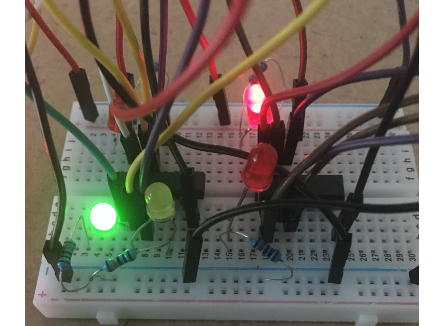

# SR (Set-Reset) flip-flop circuit

In this project I recreated a SR flip-flop circuit! Wondering what that even is? here is a pretty good definition:

>The basic building bock that makes computer memories possible, and is also used in many sequential logic circuits is the flip-flop or bi-stable circuit. Just two inter-connected logic gates make up the basic form of this circuit whose output has two stable output states. When the circuit is triggered into either one of these states by a suitable input pulse, it will ‘remember’ that state until it is changed by a further input pulse, or until power is removed. For this reason the circuit may also be called a Bi-stable Latch.

Aka its a circuit that can keep/remember a value! 

*Note: only while the computer is on, once it is turned off the value is lost*

### Diagram

### Truth Table
| Input CLK | Input S | Input R |  Output Q |   State   |
|:---------:|:-------:|:-------:|:---------:|:---------:|
|     0     |    0    |    0    | No Change |  Previous |
|     1     |    0    |    1    |     0     |   Reset   |
|     1     |    1    |    0    |     1     |    Set    |
|     1     |    1    |    1    |     -     | Forbidden |

### Items used
 - Arduino 
 - 2x [Quad 2-input positive-NOR gates](https://www.ti.com/store/ti/en/p/product/?p=SN74LS02N)
 - 5x LED lights

### Sample Run
