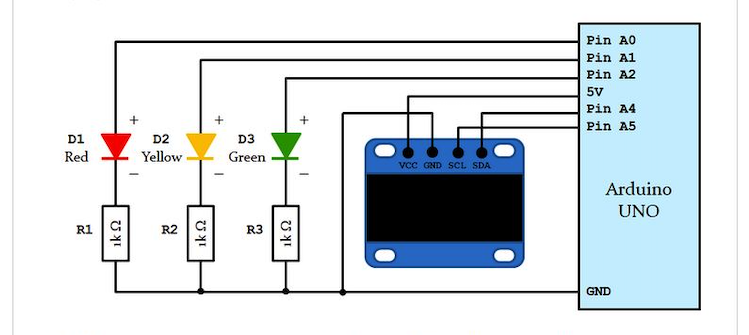
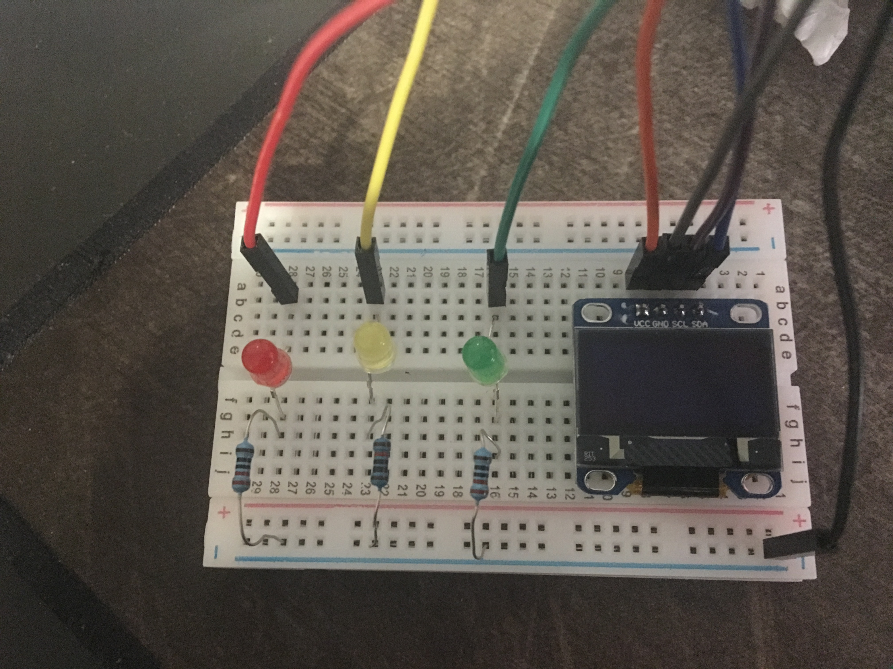
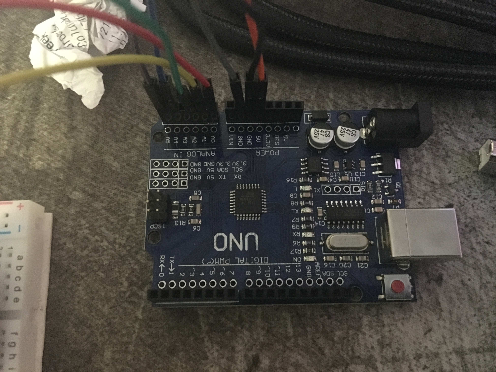

# Traffic Light

Here we are simulating a traffic light. 

Design the following circuit:

Then create a program to run a traffic signal and display text on the OLED. After the program runs, The following actions should take place
 
1. Green LED is on, Display should read " Green LED is on. Pedestrian Crossing!"
2. Yellow LED is on, Display should read "Yellow LED is on. be Prepared"
3. Red LED is on, Display should read "Red LED is on. Please stop!"

*Note: Ino files are pretty much just C files. I used the [Arduino editor](https://www.arduino.cc/en/software) and it saved them with that extension. You can use that editor or just handle them as any C file and you should be fine.*

### Devices Used

- Arduino UNO
- Led lights
- OLED Display

### System Setup

The traffic light itself:

The Arduino

Running Examples:
 - [System Start](Images/system_start.JPG)
 - [Green Light](Images/green_light.JPG)
 - [Yellow Light](Images/yellow_light.JPG)
 - [Red Light](Images/red_light.JPG)